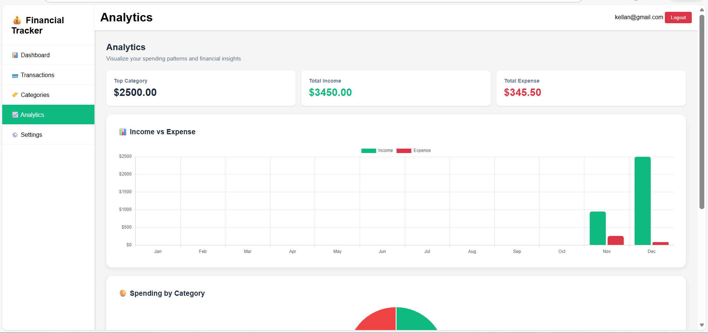
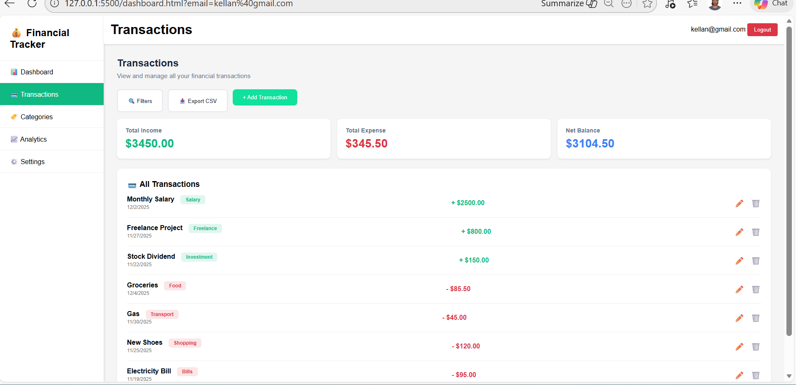
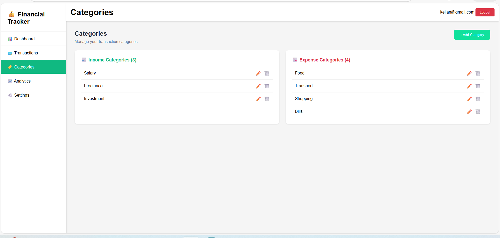

## Financial Tracker Web Application

The Financial Tracker is a web application designed to help users manage their personal finances efficiently. Users can track income, expenses, and categorize their transactions to understand their spending habits better.

## Features

Add Transactions: Users can add income and expense transactions with details such as amount, date, description, and category.

Categories: Organize transactions into categories like Salary, Food, Entertainment, Bills, etc.

Dashboard: A summary of total income, total expenses, and current balance.

Transaction History: View a detailed list of past transactions with filters.

Responsive Design: Works seamlessly on mobile, tablet, and desktop devices.

User-friendly Interface: Clean, intuitive design for easy navigation.

## Technologies Used

Frontend: HTML, CSS, JavaScript

Backend: (Optional) Firebase or local storage for storing transaction data

Libraries/Frameworks: Google Fonts, Chart.js (for visual charts).

## Installation & Setup

Clone the repository:

git clone https://github.com/graceniyigena34/Capstone-personal-financial-tracker-Project-JS-Firebase-Pre---Demo-.git

Navigate to the project folder:

cd financial-tracker

Open index.html in your web browser.

 backend is used, set up Firebase or your preferred database following the configuration instructions.

 ## Usage

Open the web application in your browser.

Add a new transaction by entering the description, amount, type (income/expense), and category.

View the summary dashboard to track your financial status.

Use the transaction history to review past transactions and manage your spending.

## Future Enhancements

User authentication and secure login

Export transactions as CSV or PDF

Advanced analytics and visual charts

Multi-currency support

Budget alerts and notifications

## The screen shoot of this project 

Firebase Image :

Analytics Image : 

Transaction Image :

Home page Image : .png>)

Categories page: 
